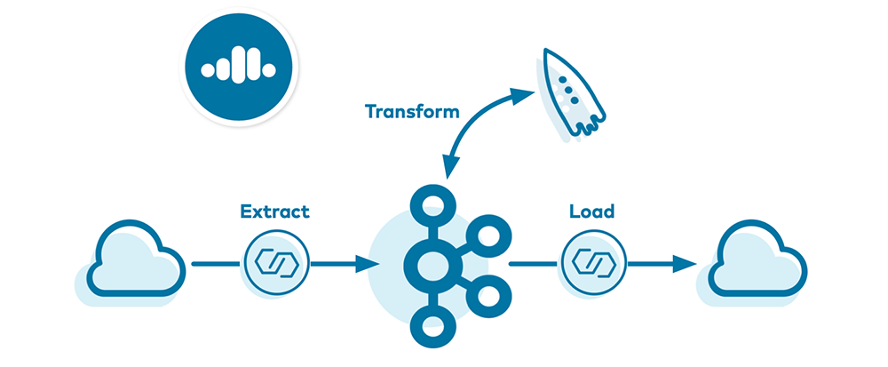
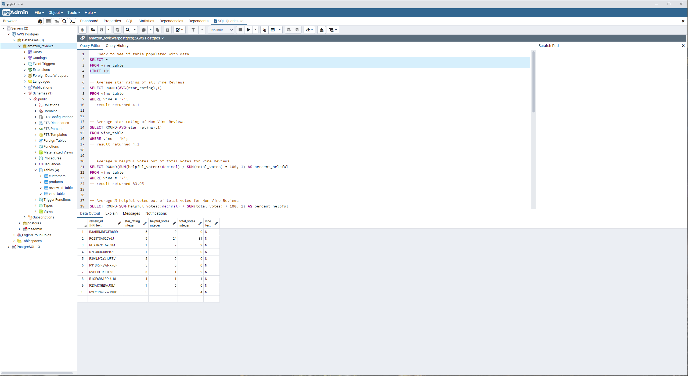

# Big Data - Extract, Transform, and Load of Amazon Review Data to AWS Cloud RDS Database

 

### Summary
Using a cloud based machine and Google colab, I used Spark and [PySpark](https://spark.apache.org/docs/latest/api/python/index.html) to download an Amazon Reviews Dataset, transformed the data for loading to an Amazon RDS Database, and loaded the data to an AWS RDS Database using [JDBC](https://docs.oracle.com/javase/tutorial/jdbc/basics/index.html).
 

### Database view using pgAdmin

 
Here you can see the data was loaded succesfully with the tables showing on the left.

In the image is also a few of the SQL queries that were run.
 

### Outline of steps performed

#### RDS Database
* Created PostgreSQL Database using Amazon RDS.
* Connected to RDS Database using pgAdmin software.
* Used provided Schema SQL file as query to create Tables in RDS Database.

#### Extract
* Review dataset was selected from https://s3.amazonaws.com/amazon-reviews-pds/tsv/index.txt
* Google Colab notebook was created.
* Imported dependencies and ran PySpark.
* Used SparkFiles to import the data making sure to specify header True.
* Counted the number of rows for imported data.

#### Transform
* Checked for and removed rows with Null values.
* Checked for duplicate rows (none found).
* Checked column data types.
* Adjusted columns to match the RDS Database column types. Specifically review_date column from string to date type, and star_rating column from string to integer.
* Created separate datframes for each Table with Columns matching the RDS database.

#### Load
* Used JDBC driver to connect and push each dataframe to corresponding table in Postgres RDS database.
 

## Vine Reviews Analysis
* [SQL Queries](/level-2/SQL-Queries.sql) - File containg SQL queries that were run for this task.

* Average Star Rating for All Vine reviews was 4.1
* Average Star Rating for All Non-Vine reviews was 4.1

This would suggest that Vine reviews do not have a higher rating than normal reviews.

* Average % of helpful votes out of total votes for Vine Reviews was 83.9%
* Average % of helpful votes out of total votes for Normal Reviews was 75.5%

This indicates Vine reviews are voted more often as helpful than normal reviews.
This makes sense are Vine reviews were given the product to provide an insightful review so they are incentivised to write a detailed review.

* Average star rating of all Vine Reviews that have at least 5 helpful_votes and at least 10 votes was 4.1
* Average star rating of Normal Reviews that have at least 5 helpful_votes and at least 10 votes was 3.4

Here we begin to see that when we start to consider reviews that were voted on by customers as unhelpful or helpful with at least 5 helpful votes, we start to see a disparity in Vine and Normal Reviews, with Normal Reviews scoring around 0.5 Stars lower on average.
 

### Conclusion:
This indicates when other customers vote and give credence to a review, then Normal reviews start to show a lower average rating than vine reviews, indicating that Vine reviews are somewhat biased. Therefore I would suggest when reading Amazon reviews one should mentally downgrade the star rating of a Vine review by 0.5 stars (half a star).

 
 

 

### Abz Raja
abzraja@gmail.com